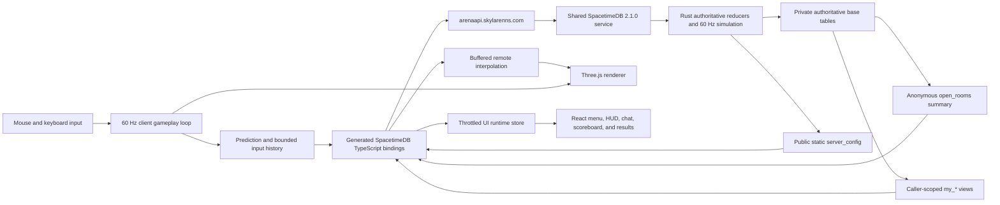

# Clean-room architecture

Arena is a desktop-first, twelve-combatant free-for-all browser FPS. The
retained React/Vite cyber UI is the presentation foundation; gameplay,
rendering, simulation, networking, generated map data, procedural assets, and
the Rust backend are clean-room implementations.

## Runtime topology

The render/simulation loop is deliberately outside React. High-frequency
movement, camera, weapon motion, effects, prediction, and interpolation update
imperatively. React receives a bounded-rate presentation snapshot for menu,
HUD, scoreboard, chat, pause, connection, elimination, and result screens.

## Workspace layers

| Layer                       | Location            | Responsibility                                                                                                     |
| --------------------------- | ------------------- | ------------------------------------------------------------------------------------------------------------------ |
| Browser client              | `apps/client`       | Input, prediction, interpolation, rendering, procedural audio, UI, and generated-binding adapter                   |
| Authoritative module        | `apps/server`       | Rooms, fixed simulation, collision, weapons, damage, bots, chat, accounts, statistics, and lifecycle               |
| Shared deterministic domain | `packages/shared`   | Map schema, collision helpers, wrap-safe ordering, gameplay constants, and client-side mirrors used for prediction |
| Generation                  | `scripts`           | Deterministic map and TypeScript binding generation plus exact-CLI wrappers                                        |
| Operations                  | `docs` and `deploy` | Versioned runbooks, isolation boundaries, and acceptance evidence                                                  |

The client and shared TypeScript code may predict an outcome but never commit
one. A prediction is discarded or reconciled when an authoritative row
disagrees.

## Authority matrix

| State or decision | Client may submit                                       | Server owns                                                                        |
| ----------------- | ------------------------------------------------------- | ---------------------------------------------------------------------------------- |
| Movement          | Sequenced axes, buttons, yaw, and pitch                 | Position, velocity, collision, bounds, and accepted sequence                       |
| Weapons           | Desired slot and cumulative action counters             | Loadout, ammo, reload state, cadence, spread seed, ray resolution, and impact      |
| Combat            | Fire intent and a bounded client tick                   | Hit, damage, protection, death, attribution, score, and respawn                    |
| Rooms             | Sanitized request to quick play, create, join, or leave | Room selection, codes, capacity, phase, and cleanup                                |
| Bots              | Nothing                                                 | Slot filling, target perception, navigation, aim variance, combat, and replacement |
| Match             | Nothing                                                 | 30-elimination/10-minute end, standings, intermission, and reset                   |
| Chat              | Text candidate                                          | Validation, rate limit, room scope, author identity, and retained event            |
| Accounts          | Registration/login candidate over the active connection | Credential validation, account/session mapping, and persistent statistics          |
| Rendering         | Graphics preference                                     | No gameplay authority                                                              |

Clients never send transforms, health, damage, hit identities, score, ammo, or
inventory deltas.

## Published data boundary

The authoritative room, player, weapon, pickup, event, account, session,
rate-limit, lag-history, and bot-brain base tables are private. Generated
bindings subscribe to deliberately narrow public surfaces:

| Public surface         | Caller and exposed data                                                                |
| ---------------------- | -------------------------------------------------------------------------------------- |
| `server_config`        | Static public simulation/map contract and the `accounts_enabled` launch gate           |
| `open_rooms`           | Anonymous room browser: `id`, `code`, `phase`, `round`, `human_count`, and `bot_count` |
| `my_room_state`        | The connected caller's current room state only                                         |
| `my_room_players`      | Players in that room; acknowledgement counters are real only for the caller            |
| `my_weapon_states`     | Weapon inventory and timing for the caller's player only                               |
| `my_room_pickups`      | Pickup state for the caller's room only                                                |
| `my_room_match_events` | Retained match events for the caller's room only                                       |
| `my_room_chat_events`  | Retained chat events for the caller's room only                                        |
| `my_account_session`   | The caller's optional account-session result only                                      |
| `my_account_stats`     | Persistent statistics for the caller's active account only                             |
| `my_action_result`     | The caller's latest committed reducer action result only                               |

`open_rooms` deliberately omits per-tick clocks, transforms, health,
inventory, chat, and player identity. It is a low-frequency discovery summary,
not a gameplay subscription. Joining a room establishes the caller scope used
by the gameplay views. A view returning no row is not permission for the client
to subscribe directly to a private base table.

## Room and match invariants

- A room has exactly 12 combatant rows while it is in use.
- Vacant human slots are server-controlled bots. A human claim converts one
  eligible bot slot without creating a thirteenth combatant.
- Quick play prefers the active room with the most humans and free capacity,
  then creates a room.
- The simulation runs at 60 ticks per second.
- A round ends at 30 eliminations or after 36,000 ticks (10 minutes).
- Results/intermission lasts 600 ticks (10 seconds), then the room resets for a
  new round.
- Death schedules a server respawn after 180 ticks (3 seconds).
- Spawn selection maximizes distance from living threats; spawn protection is
  server-owned.
- Empty rooms are eligible for bounded server cleanup. Cleanup must never
  affect another room or another SpacetimeDB database.

## Identity and optional accounts

The SpacetimeDB connection identity is the authorization principal for a
browser session. Guests retain the issued identity token in `sessionStorage`,
under a key derived from the normalized endpoint and database, so a transient
disconnect can reclaim the reserved room slot. The token is not persisted in
`localStorage`, is not an account password, and is never reused for a different
endpoint/database scope. Registration is not required for quick play.

The browser enables account UI and credential reducers only when the normalized
endpoint is `https://arenaapi.skylarenns.com`, the database is
`arena-fps-slice`, and `server_config.accounts_enabled` is true. Custom and
fallback backends remain guest-only even if they publish a true flag,
preventing the UI from sending an Arena password to an untrusted selector
target.

An Arena account is an optional application-level record linked to the current
connection identity. Persistent statistics are credited only when a valid
account session is present. The caller-scoped account views do not expose
password hashes, email keys, rate-limit rows, raw lag history, bot internals,
or private player-session mappings.

Password hashing, reducer limits, a global authentication budget, and
account-level lockout guards reduce risk but do not establish real-world
identity. Registration currently lacks verified email ownership, OIDC, and
Turnstile or equivalent bot attestation. Before unrestricted public account
registration, require OIDC/verified email or an abuse-resistant registration
gateway; otherwise keep password registration disabled through
`server_config.accounts_enabled`. Guest play can remain available without
presenting account registration as a verified identity boundary.

## Assets and performance

Map geometry, materials, rain, lighting, weapon effects, animation, and audio
are authored or synthesized in the repository. No runtime dependency may fetch
a third-party model, texture, music track, or sound effect.

Low, medium, and high presets scale rendering cost without changing server
collision or gameplay rules. Performance acceptance is a stable 60 FPS at
1080p on the target modern desktop, measured during a populated 12-combatant
match rather than an empty map.

## Production isolation boundary

Arena shares `spacetimedb.service` on `192.168.1.174:4789`. Publishing the Arena
module does not authorize restarting, reconfiguring, or deleting that service.
It also does not authorize changes to:

- `gmbl`, including its separate service on port `9299`;
- `parrot`, including its Docker-published port `39100`;
- any unrelated database, repository, process, port, tunnel route, or DNS
  record.

The only replaceable database is the exact Arena identity recorded in
[Production cutover](production-cutover.md).
